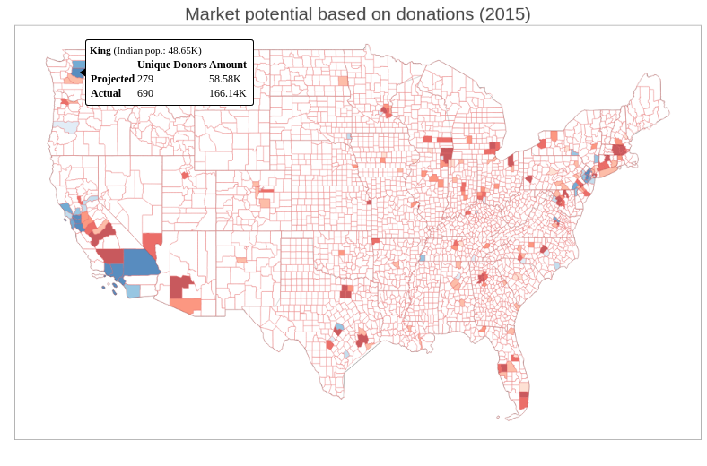
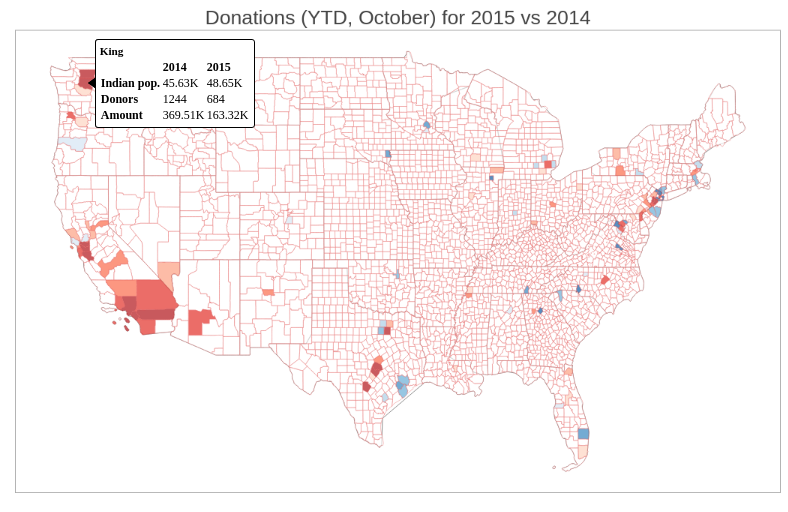
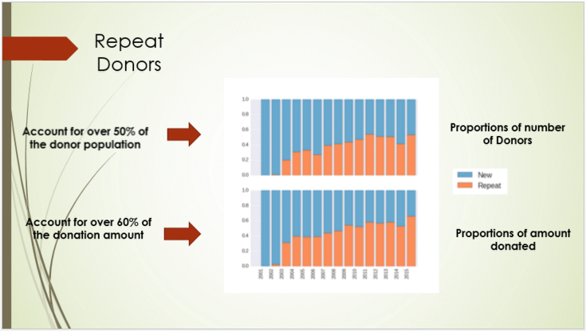

# SEF Donor Data Study

### Project description  
This is a project that I undertook for a non-profit organization called Sankara Eye Foundation (SEF, www.giftofvision.org).
SEF performs free eye surgeries for the underprivileged people in India.  

This project is a study of a dataset containing the donations made to this organization. The dataset was organized for day-to-day operational use by the organization and my contribution is to extract useful information from this data and help understand it better.

### Input dataset
The dataset consists of transactions made by donors to the organization. Each row represents a single transaction. A transaction can be money given towards a fund raiser or a charitable contribution (donation).

### Fund raiser vs Donation
A fund raiser event is an event organized by volunteers of the organization to raise awareness about it. It usually has an entertainment component for which people pay money to attend. This gives the ability to connect with potential donors through the fund raiser and this creates an avenue by which people can start donating to the organization's cause.

### High-level Process

1. Break down each transaction as a fund raiser or a donation.  
2. From the fund raiser dollars, extract information about the fund raisers (location, time, size, amount raised).  
3. From the donation dollars, extract information about the donors (frequency of donation, amount donated, churn by region).  
4. Generate insights for the organization for repeat donors.  
5. Create interactive visualizations using bokeh (see below)
6. A time-series analysis followed by predictions of the donation amounts into the future.  

### Folder structure
- notebooks: This folder has ipython notebooks to perform the steps of feature extraction, visualizations and the time-series analysis. The README under this folder has more detail about the individual notebooks.

### Visualizations

#### 1. Where do we see market growth opportunity?**

#### 2. How are donations this year in comparison with last year?**

#### 3. How are repeat donors contributing over time?

** Indian population is extrapolated from the Migration Policy Institute tabulations of the U.S. Census Bureau’s pooled 2006-10 and 2010-14 American Community Survey
